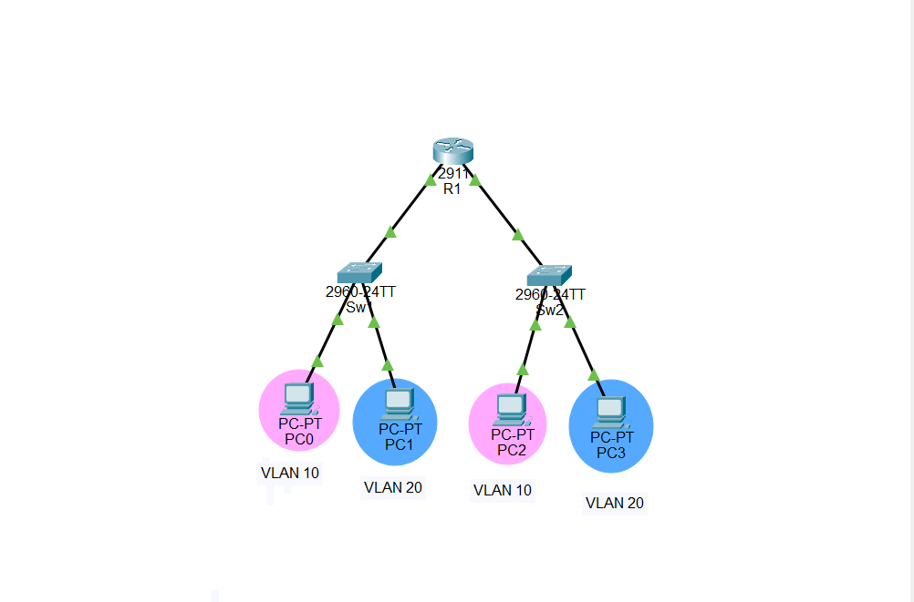
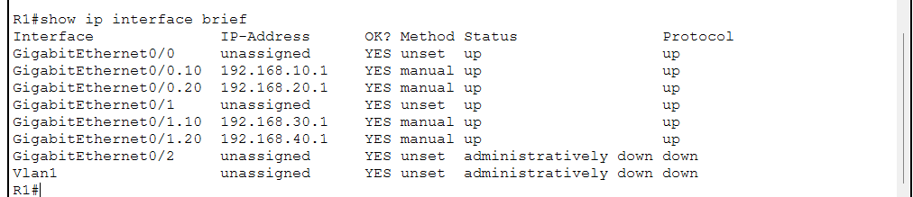
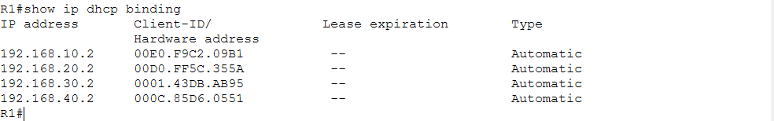
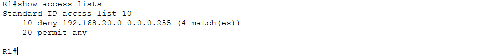
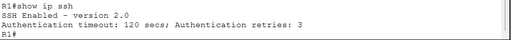
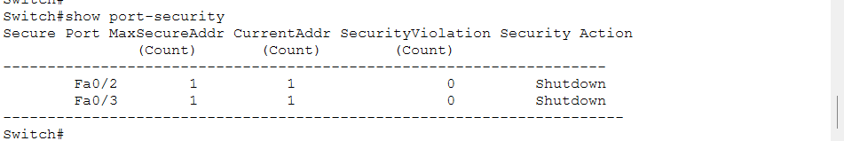
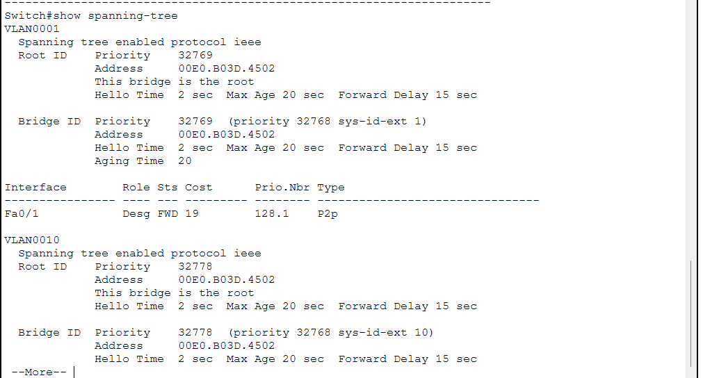

# CCNA Day 13 – Enterprise Mini Project

## Overview

This project demonstrates the design and configuration of a small enterprise network using Cisco Packet Tracer. 

The network integrates multiple networking and security technologies learned throughout the CCNA labs, including VLANs, Inter-VLAN Routing, DHCP, ACLs, SSH, Port Security, and STP.

The project was designed to provide network segmentation, automatic IP address assignment, secure remote management, access control, and basic Layer 2 security.

## Objectives

* Design a small enterprise network topology
* Configure VLANs for network segmentation
* Configure trunk links between switches and the router
* Configure Inter-VLAN Routing using Router-on-a-Stick
* Configure DHCP for automatic IP address assignment
* Configure Standard ACL to control network access
* Configure SSH for secure remote management
* Configure Port Security on switch access ports
* Verify STP operation
* Test connectivity between network devices
* Verify the configuration using Cisco IOS commands

## Network Topology

The enterprise network consists of one router, two Cisco 2960 switches, and four PCs.

```text
                         R1
                       /    \
                      /      \
                    SW1      SW2
                   /  \      /  \
                 PC0  PC1  PC2  PC3
```

The router provides Inter-VLAN Routing and DHCP services.

SW1 and SW2 provide access connectivity to the end devices.



## VLAN Design

Two VLANs were configured to logically separate the network users.

| VLAN    | Name           | Network         |
| ------- | -------------- | --------------- |
| VLAN 10 | Administration | 192.168.10.0/24 |
| VLAN 20 | IT             | 192.168.20.0/24 |

On the second switch, separate subnets were used for the same VLAN IDs.

| VLAN    | Network         |
| ------- | --------------- |
| VLAN 10 | 192.168.30.0/24 |
| VLAN 20 | 192.168.40.0/24 |

## IP Addressing

The router was configured with the following gateway addresses:

| Interface | IP Address   | Purpose         |
| --------- | ------------ | --------------- |
| G0/0.10   | 192.168.10.1 | VLAN 10 Gateway |
| G0/0.20   | 192.168.20.1 | VLAN 20 Gateway |
| G0/1.10   | 192.168.30.1 | VLAN 10 Gateway |
| G0/1.20   | 192.168.40.1 | VLAN 20 Gateway |

The PCs received their IP addresses automatically through DHCP.



## VLAN Configuration

VLAN 10 and VLAN 20 were configured on both switches.

Access ports were assigned to the appropriate VLANs, while the router-facing interfaces were configured as trunk ports.

The following configuration was used on the access ports:

```cisco
enable
configure terminal

vlan 10
name Administration
exit

vlan 20
name IT
exit

interface fa0/2
switchport mode access
switchport access vlan 10
exit

interface fa0/3
switchport mode access
switchport access vlan 20
exit

interface fa0/1
switchport mode trunk
exit

end
```

## Inter-VLAN Routing

Router-on-a-Stick was configured on R1 to provide communication between the VLANs.

The following subinterfaces were configured:

```cisco
interface g0/0.10
encapsulation dot1Q 10
ip address 192.168.10.1 255.255.255.0

interface g0/0.20
encapsulation dot1Q 20
ip address 192.168.20.1 255.255.255.0

interface g0/1.10
encapsulation dot1Q 10
ip address 192.168.30.1 255.255.255.0

interface g0/1.20
encapsulation dot1Q 20
ip address 192.168.40.1 255.255.255.0
```

This configuration allows devices in different VLANs to communicate through the router.

## DHCP Configuration

DHCP was configured on R1 to automatically assign IP addresses to the PCs.

The following DHCP pools were configured:

```cisco
ip dhcp pool VLAN10
network 192.168.10.0 255.255.255.0
default-router 192.168.10.1

ip dhcp pool VLAN20
network 192.168.20.0 255.255.255.0
default-router 192.168.20.1

ip dhcp pool SW2-VLAN10
network 192.168.30.0 255.255.255.0
default-router 192.168.30.1

ip dhcp pool SW2-VLAN20
network 192.168.40.0 255.255.255.0
default-router 192.168.40.1
```

All four PCs successfully received IP addresses through DHCP.



## Connectivity Testing

Connectivity between the VLANs was tested using ICMP ping.

The tests confirmed that Inter-VLAN Routing was functioning correctly.

Devices in VLAN 10 were able to communicate with devices in VLAN 20 before applying the access control policy.

## Standard ACL

A Standard ACL was configured to restrict traffic from the `192.168.20.0/24` network.

The following ACL was configured:

```cisco
access-list 10 deny 192.168.20.0 0.0.0.255
access-list 10 permit any
```

The ACL was applied to the VLAN 10 subinterface:

```cisco
interface g0/0.10
ip access-group 10 out
```

The ACL successfully matched traffic from the specified network.



## SSH Configuration

SSH was configured on R1 to provide secure remote management.

The following configuration was used:

```cisco
hostname R1
ip domain-name enterprise.local
username admin privilege 15 secret cisco123

crypto key generate rsa

line vty 0 4
login local
transport input ssh
exit

ip ssh version 2
```

SSH version 2 was successfully enabled and verified.



## Port Security

Port Security was configured on the access ports connected to the PCs.

Each port was configured to allow only one MAC address using Sticky MAC learning.

The violation mode was configured as `shutdown`.

```cisco
interface fa0/2
switchport mode access
switchport port-security
switchport port-security maximum 1
switchport port-security mac-address sticky
switchport port-security violation shutdown
exit

interface fa0/3
switchport mode access
switchport port-security
switchport port-security maximum 1
switchport port-security mac-address sticky
switchport port-security violation shutdown
```

The switch successfully learned one secure MAC address on each protected port.

No security violations were detected during the final verification.



## Spanning Tree Protocol

STP was verified on the switches to ensure that the Layer 2 switching topology was operating correctly.

The following command was used:

```cisco
show spanning-tree
```

The STP output was used to verify the Root Bridge, port roles, and forwarding states.



## Verification Commands

The following Cisco IOS commands were used throughout the project:

```cisco
show ip interface brief
show ip dhcp binding
show access-lists
show ip ssh
show port-security
show spanning-tree
```

These commands were used to verify interface status, DHCP assignments, ACL operation, SSH configuration, Port Security, and STP.

## What I Learned

* VLANs provide logical network segmentation.
* Trunk links can carry traffic from multiple VLANs.
* Router-on-a-Stick allows communication between different VLANs.
* DHCP can automatically assign IP addresses to network devices.
* ACLs can control traffic based on source IP addresses.
* SSH provides secure remote management of Cisco devices.
* Port Security helps prevent unauthorized devices from accessing switch ports.
* STP helps maintain a loop-free Layer 2 network.
* Network verification commands are essential for troubleshooting and validating configurations.
* Combining multiple networking technologies creates a more structured and secure enterprise network.

## Author

**Kawthar Bader**
Computer Networks Student | CCNA Learner | Building Networking Labs
